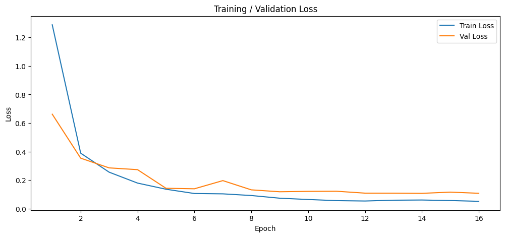
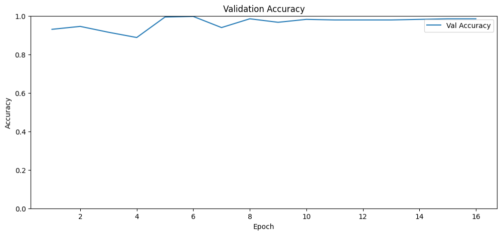
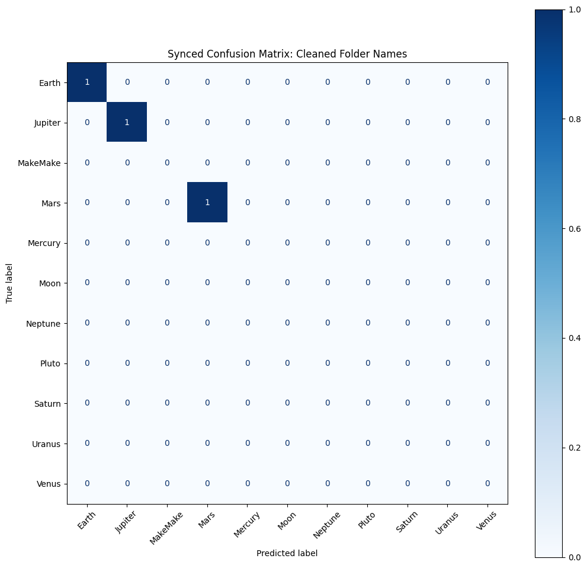
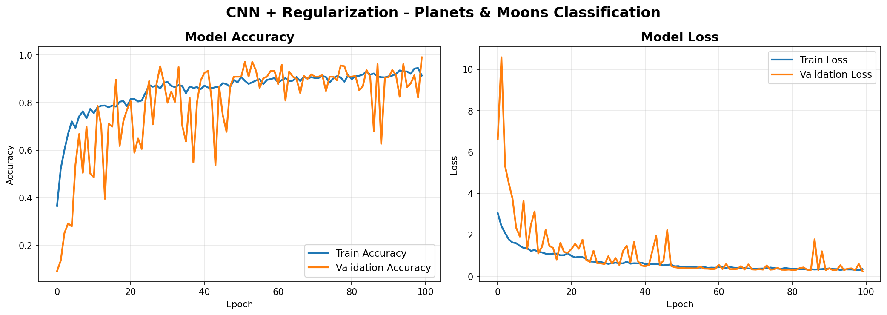
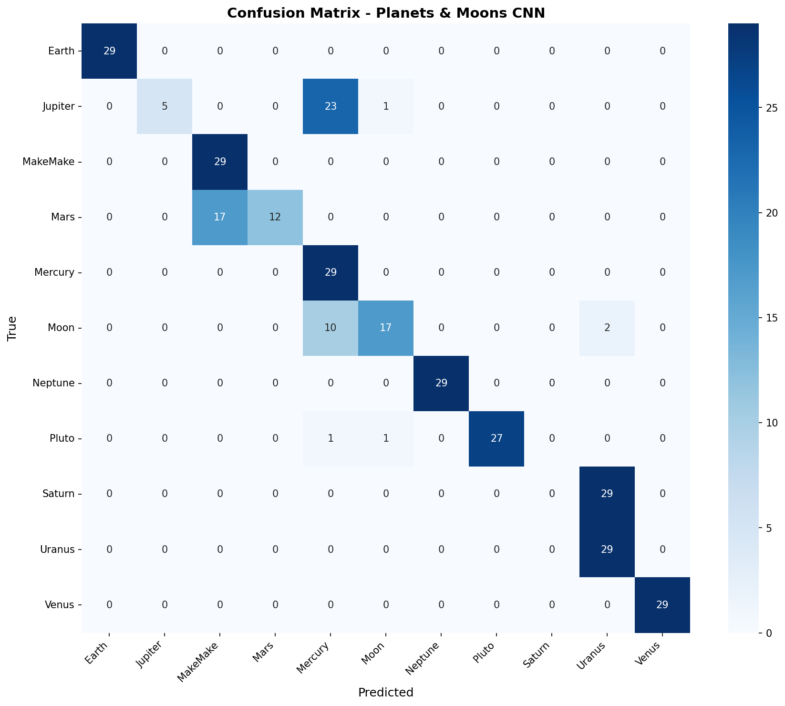
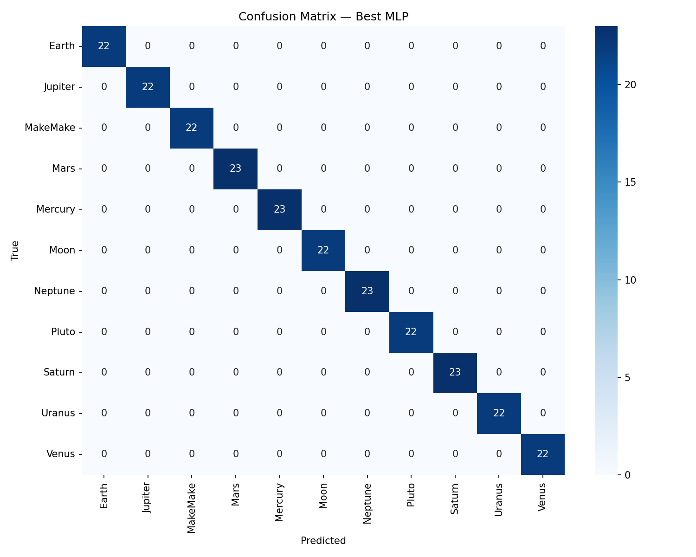

# 🛰️ Astronomical Object Detection
### A Deep Learning Architecture Comparison Study


## ⚔️ Overview

This project is a focused exploration into the effectiveness of **three distinct deep learning paradigms** in the domain of astronomical object classification and localization.

**The Task:**
> Identify and distinguish between planetary bodies — **Mercury, Venus, Earth, Mars** — under the constraints of visual similarity, low feature contrast, and spatial ambiguity.

Three architectures were deployed:

| # | Model | Type |
|---|-------|------|
| 1 | **Multilayer Perceptron (MLP)** | Baseline |
| 2 | **Custom CNN + Regression** | Spatial Learner |
| 3 | **Transfer Learning** | Pre-trained Visual Intelligence |

> The objective was not just accuracy — but understanding **which architecture perceives structure, space, and nuance most effectively.**

---

## 🧠 Core Insight

> *Not all models see the same way.*
> *Some memorize. Some observe. Few understand.*

---

## 🏗️ Architecture Breakdown

| Model | Type | Strength | Limitation |
|-------|------|----------|------------|
| **MLP** | Fully Connected | Fast, simple baseline | No spatial awareness |
| **CNN + Regression** | Custom Deep CNN | Learns spatial hierarchies | Requires more training |
| **Transfer Learning** | Pretrained CNN | Immediate feature mastery | Dependent on pretrained bias |

---

## 📊 Performance Summary

### 🥇 Transfer Learning — Dominant

| Metric | Value |
|--------|-------|
| Validation Accuracy | ~100% |
| Convergence | Immediate |
| Class Confusion | None |

**Interpretation:** Pretrained filters already encode planetary-level abstractions.

#### 📈 Training / Validation Loss


#### 📉 Validation Accuracy


#### 🔍 Confusion Matrix


---

### 🥈 CNN + Regression — Disciplined Learner

| Metric | Value |
|--------|-------|
| Validation Accuracy | ~94% |
| Convergence | Stable, smooth |
| Notable Strength | Edge and shape detection |

**Interpretation:** Learns geometry and spatial identity effectively from scratch.

#### 📈 Training History


#### 🔍 Confusion Matrix


---

### 🥉 MLP — Baseline Constraint

| Metric | Value |
|--------|-------|
| Validation Accuracy | ~90% |
| Convergence | Acceptable but limited |
| Notable Weakness | Venus / Earth confusion |

**Interpretation:** Flattened input destroys spatial structure → weak feature distinction.

#### 📈 Training History


#### 🔍 Confusion Matrix


---

## 🧬 Key Findings

1. **Transfer Learning dominates** when data is visually complex but structurally familiar to pretrained networks.
2. **CNNs trained from scratch** can approach high performance, given sufficient data and tuning.
3. **MLPs fail in spatial domains** — they cannot preserve positional relationships.

---

## ⚙️ Tech Stack

| Category | Tools |
|----------|-------|
| Language | Python 3.10+ |
| Deep Learning | TensorFlow / Keras |
| Data Processing | NumPy |
| Visualization | Matplotlib |
| Evaluation | Scikit-learn |

---

## 🛠️ Installation

```bash
pip install tensorflow matplotlib numpy scikit-learn
```

---

## 📂 Project Structure

```
.
├── results/
│   ├── transfer_learning/
│   │   ├── output.png          # Confusion matrix
│   │   ├── output1.png         # Training / validation loss
│   │   └── output2.png         # Validation accuracy
│   ├── cnn_reg/
│   │   ├── training_history.png
│   │   └── confusion_matrix.png
│   └── mlp/
│       ├── accuracy.png
│       ├── confusion_matrix.png
│       └── mlp_results.json
│
├── models/
│   ├── mlp/
│   ├── cnn_reg/
│   └── transfer_learning/
│
├── notebooks/
├── src/
└── README.md
```

---

## 🚀 Execution Flow

1. **Preprocess** dataset (resize, normalize)
2. **Train** models independently:
   - MLP
   - CNN + Regression
   - Transfer Learning
3. **Evaluate** using:
   - Accuracy curves
   - Loss curves
   - Confusion matrices
4. **Compare** convergence and generalization across architectures

---

## 🧭 Conclusion

> The experiment reveals a simple truth:
> *Vision is not about seeing pixels — it is about understanding structure.*

| Model | Perception Level |
|-------|-----------------|
| MLP | Sees **numbers** |
| CNN | Sees **shapes** |
| Transfer Learning | Sees **meaning** |

---

## 🤝 Collaborators

| Name | Role |
|------|------|
| 👑 [Ahmed boray](https://github.com/silragon-ryu) | Team Lead · AI Architect · Transfer Learning |
| [Ahmet Cemil Bostanoğlu](https://github.com/acbst0) | CNN + Regression |
| [Berke Emir Yaşacan](https://github.com/EmirYscn) | MLP |
| [Mark tendo](https://github.com/comicjelly) | Data Analysis & Processing |
| [Mezred Mohamed Wassim ](https://github.com/Woozie0) | Data Analysis & Processing |

---

> *This project was not built to just work. It was built to understand **why** it works.*